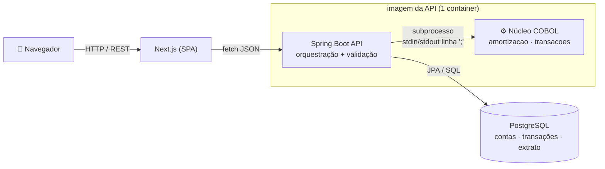

# 🏦 Core Bancário em COBOL, Modernizado

Sistema bancário cujo **núcleo de processamento financeiro é escrito em COBOL** e
exposto por uma arquitetura web atual (API REST + SPA). O projeto conta uma
história de **modernização de legado**: uma lógica de negócio crítica em COBOL,
aproveitando a **aritmética decimal exata** (`PACKED-DECIMAL` / `COMP-3`) que é o
forte da linguagem, embrulhada por uma stack moderna que cuida de API,
persistência e interface.

> **O COBOL não é decorativo.** Ele é o dono das regras de negócio e dos cálculos:
> processa transações (depósito/saque/transferência) com validação de saldo e
> limite, gera as tabelas de amortização de empréstimo (Price, SAC e Americano)
> com os **custos regulatórios brasileiros** — IOF e CET (este resolvido por
> bisseção dentro do COBOL) — e simula investimentos (CDB/Poupança) com **IR
> regressivo**. A API orquestra; o COBOL decide e calcula.

---

## Arquitetura



**Divisão de responsabilidades:**

| Camada | Faz | Não faz |
|--------|-----|---------|
| **Núcleo COBOL** | cálculo financeiro, validação de regra (saldo, limite), aritmética decimal exata | nada de banco, HTTP ou estado — é **stateless** |
| **API (Spring Boot)** | CRUD, autenticação (simples), validação de entrada, persistência, transações, orquestração do COBOL | não faz aritmética de dinheiro (delega ao COBOL) |
| **Front (Next.js)** | telas de conta, transações e simulador | só **formata** dinheiro, nunca calcula |
| **PostgreSQL** | contas, clientes, histórico/extrato em `NUMERIC(15,2)` | — |

### Como uma transação flui

```mermaid
sequenceDiagram
    participant W as Front
    participant A as API (Spring)
    participant Cb as COBOL (subprocesso)
    participant DB as PostgreSQL

    W->>A: POST /contas/1/saque {valor}
    A->>DB: SELECT ... FOR UPDATE (trava a conta)
    A->>Cb: stdin "SAQUE;valor;saldo;0;limite"
    Cb-->>A: stdout "OK;novo_saldo"  (ou "ERRO;saldo insuficiente")
    A->>DB: UPDATE saldo + INSERT extrato
    A-->>W: 200 {saldo}   (ou 422 {message})
```

A fronteira com o COBOL vive **isolada numa única classe** (`CobolGateway`), de
modo que dá pra evoluir a integração (subprocesso → biblioteca compartilhada via
FFI) sem tocar no resto.

---

## Stack

- **Núcleo:** COBOL (GnuCOBOL / `cobc`)
- **API:** Java 21 + Spring Boot 3.3 (JPA, Flyway, Bean Validation)
- **Banco:** PostgreSQL 16
- **Front:** React + Next.js 14 (App Router)
- **Orquestração:** Docker + Docker Compose

---

## Subir tudo com um comando

Pré-requisito: **Docker** (com Compose).

```bash
docker compose up -d --build
```

Serviços:

| Serviço | URL |
|---------|-----|
| Front (Next.js) | http://localhost:3000 |
| API (Spring Boot) | http://localhost:8080 |
| PostgreSQL | localhost:**5433** (host) → 5432 (interno) |

> A porta do Postgres é **5433 no host** de propósito (5432 costuma estar ocupado).
> Internamente a API acessa `db:5432`.

Parar: `docker compose down` (mantém os dados). Zerar o banco: `docker compose down -v`.

---

## Estrutura do repositório

```
core-bancario-cobol/
├── cobol/                     # Núcleo: regras e cálculos financeiros
│   ├── src/
│   │   ├── amortizacao.cob    # tabela Price/SAC/Americano + IOF + CET
│   │   ├── transacoes.cob     # depósito / saque / transferência
│   │   └── investimento.cob   # CDB/Poupança: juros compostos + IR regressivo
│   ├── tests/                 # baterias de teste por invariantes
│   └── Dockerfile             # imagem só-COBOL (roda os testes isolados)
├── api/                       # API de orquestração (Spring Boot)
│   ├── src/main/java/com/portfolio/banco/
│   │   ├── cliente/ conta/ transacao/ emprestimo/
│   │   ├── cobol/CobolGateway.java   # <- ÚNICA fronteira com o COBOL
│   │   └── common/                   # erros, CORS
│   ├── src/main/resources/db/migration/  # schema (Flyway)
│   └── Dockerfile             # multi-stage: jar + binários COBOL na mesma imagem
├── web/                       # Front (Next.js)
├── docker-compose.yml         # sobe DB + API(+COBOL) + Web
└── README.md
```

---

## Endpoints principais

| Método | Rota | Descrição |
|--------|------|-----------|
| `POST` | `/clientes` | cria cliente |
| `POST` | `/contas` | cria conta (com limite de cheque especial) |
| `GET`  | `/contas` · `/contas/{id}` · `/contas/{id}/saldo` | consulta |
| `POST` | `/contas/{id}/deposito` · `/saque` · `/transferencia` | **aciona o COBOL** |
| `GET`  | `/contas/{id}/extrato` | histórico |
| `GET`  | `/contas/{id}/razao` | livro razão da conta (partidas dobradas) |
| `GET`  | `/razao/balancete` | balancete: prova que débitos = créditos |
| `POST` | `/emprestimos/simular` | tabela Price/SAC/Americano + IOF + CET — **aciona o COBOL** |
| `POST` | `/investimentos/simular` | CDB/Poupança: juros compostos + IR regressivo — **aciona o COBOL** |

Exemplos:

```bash
# Depósito (a soma exata é feita pelo COBOL)
curl -X POST localhost:8080/contas/1/deposito -H 'Content-Type: application/json' -d '{"valor":1000.50}'

# Simular empréstimo (tabela calculada no COBOL)
curl -X POST localhost:8080/emprestimos/simular -H 'Content-Type: application/json' \
  -d '{"valor":100000.00,"taxaMensal":0.015,"prazoMeses":12,"sistema":"PRICE"}'
```

---

## Decisões de engenharia

- **Dinheiro sempre decimal exato.** COBOL em `PIC S9(13)V99 COMP-3`, Postgres em
  `NUMERIC(15,2)`, Java em `BigDecimal`. **Nunca `float`/`double`.** No caminho da
  API o dinheiro trafega como *string* — o JavaScript e o Java não fazem aritmética
  de dinheiro; o COBOL faz. (Prova viva: `0.10 + 0.20` devolve `0.30`, não
  `0.30000000000000004`.)
- **Fronteira COBOL isolada.** A API chama os executáveis como subprocesso e troca
  dados em **linhas delimitadas por `;`** via stdin/stdout — COBOL monta JSON mal;
  Java monta o formato. Tudo confinado em `CobolGateway`.
- **Binários COBOL na imagem da API.** No modelo subprocesso a API *exec*uta o
  binário, então eles vivem no mesmo container (compilados no build multi-stage,
  na mesma base que os roda → ABI casado).
- **Trava pessimista no caminho do dinheiro.** `SELECT ... FOR UPDATE` na conta
  evita *lost update* em operações concorrentes; a transferência trava as duas
  contas em ordem de id (anti-deadlock).
- **Validação em camadas.** Bean Validation na entrada (HTTP 400), regra de negócio
  no COBOL propagada como HTTP 422, e **constraints no próprio banco**
  (`valor > 0`, `limite >= 0`) como última rede de segurança.
- **Razão contábil de partidas dobradas.** Toda transação grava, na mesma transação
  do banco, um lote de lançamentos balanceados (Σ débitos = Σ créditos), com a conta
  interna `CAIXA` fechando a contrapartida. O `transacao` é o extrato do cliente; o
  `lancamento` é o livro razão — auditável e reconciliável. O balancete prova o
  equilíbrio dos livros.
- **Fechamento de arredondamento.** Na última parcela do empréstimo a amortização
  absorve o resíduo, zerando o saldo devedor em `0.00` exato (prática bancária real).
- **Custos regulatórios no COBOL.** IOF (adicional 0,38% + diário 0,0082%/dia, dias
  ≤ 365) e **CET** — a taxa efetiva é achada por **bisseção** sobre o fluxo de
  parcelas, um cálculo numérico iterativo rodando no núcleo COBOL. (Dias por mês =
  30, sem data de início; refinável com calendário real.)
- **IR regressivo no COBOL.** O simulador de investimento capitaliza juros compostos
  (crédito mensal arredondado) e aplica a tabela regressiva de IR por prazo
  (22,5% → 15%); a Poupança entra como isenta, evidenciando o contraste tributário.

---

## Como testar cada parte

**Núcleo COBOL isolado** (só Docker, sem instalar GnuCOBOL):

```bash
docker build -t cobol-core ./cobol && docker run --rm cobol-core
```
Roda as baterias de amortização e transações (asserts de invariantes: saldo fecha
em `0.00`, soma das amortizações = principal, parcela fixa no Price, etc).

**Testes da API** (camada web):

```bash
cd api && mvn test
```

**Fluxo end-to-end:** suba o compose e use o front em http://localhost:3000, ou os
`curl` acima.

---

## Fora de escopo (MVP enxuto)

Múltiplas moedas/câmbio, autenticação robusta (login simples basta) e app mobile.
A arquitetura deixa espaço para todos eles sem reescrita.
